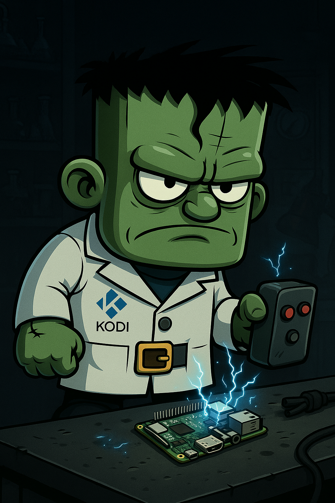

<p align="center">
  
</p>

<h1 align="center">Frankie Operating Theatre 🛠️</h1>

Welcome to the den where Pi’s are resurrected, kernels are tamed, and the great Frankie rises again.

---

### 🔧 What you’ll find here
- **Workstation Setup** – Build your ultimate Pi workstation (`pi-workstation.sh`)
- **Recovery / Dev Tools** – Hardened dev + recovery environment (`pi-dev-recovery.sh`)
- **Backup & Restore** – Archive and restore `/home/pi` safely (`pi-backup.sh`, `pi-restore.sh`)
- **GitHub SSH Setup** – One-shot script for SSH key + Git config (`setup-ssh-github.sh`)

---

### 🚀 Quick Start

```
curl -fsSL https://raw.githubusercontent.com/Drtweak86/frankie-operating-theatre/main/pi-workstation.sh | bash

```

---

### 📂 Scripts
| Script Name | Purpose |
|-------------|---------|
| `pi-workstation.sh` | Full desktop + build environment setup |
| `pi-dev-recovery.sh` | Dev utilities & system tweaks for recovery workflows |
| `pi-backup.sh` | Smart backup of /home/pi with exclusions |
| `pi-restore.sh` | Restore backup with progress bar |
| `setup-ssh-github.sh` | GitHub SSH key & Git config setup |

---

### 📦 Why this exists

Because one day you will face the **Blue Screen of Pi Death**,  
Proto-Frankie will fight the kernel panic,  
and a **one-click rebuild** will save you.

---

### 💡 Pro Tip

Never stop believing. The boots are real.  
Viewpowers, high speeds, no limits.
